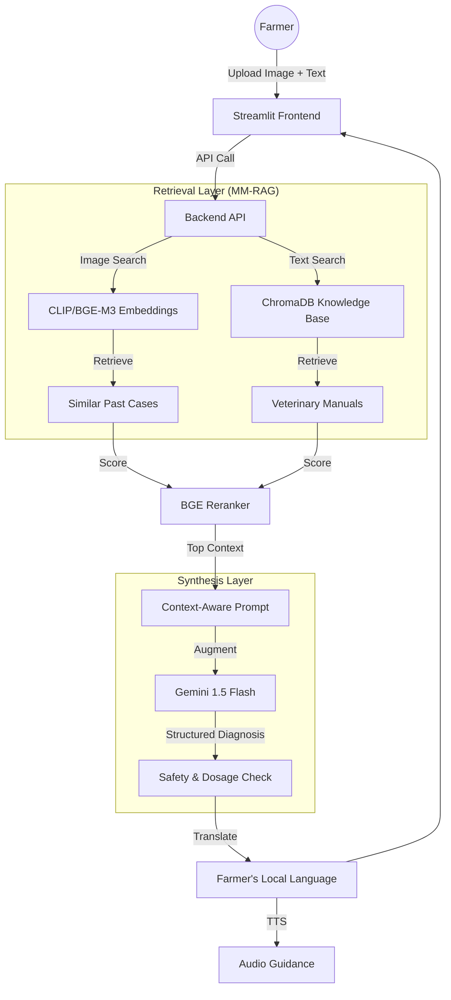
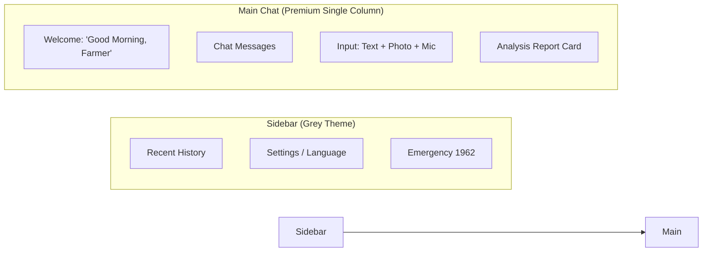

# 🐄 Solving Livestock Health with AI: My Journey from the Farm to Multi-Modal RAG

### 🌾 The Inspiration
Daily seeing my father struggle to solve the health problems of our cattle—sheep, goats, and cows—I realized how critical quick, expert advice is for a farmer. In rural areas, a veterinarian isn't always a phone call away. This sparked the idea for **PashuDoctor**: a professional AI assistant designed specifically for the Indian farming community.

---

### 🚀 The Technology: Multi-Modal RAG (MM-RAG)
PashuDoctor isn't just a chatbot; it’s a high-precision **Multi-Modal Retrieval-Augmented Generation** system. Here is how it works:

#### 📂 Project Structure
```text
pashudoctor/
├── backend/
│   ├── app/
│   │   ├── routers/       # Analyze, Chat, History, Alerts
│   │   ├── services/      # Gemini LLM, ChromaDB Retrieval, BGE Reranker
│   │   ├── utils/         # Confidence Scoring, Herd Alert, Breed Intelligence
│   │   └── main.py        # FastAPI Entry point
├── frontend/
│   └── app.py             # Streamlit "ChatGPT-style" Farmer UI
├── data/
│   ├── vector_db/         # ChromaDB (Image + Text embeddings)
│   └── uploads/           # Secure image storage
```

#### 🔄 Architecture Flow


---

### 🛠️ Key Features Highlight
1. **Multi-Modal Diagnosis**: Upload a photo of a symptom (e.g., foot blisters or skin lumps) + description.
2. **AI Safety Guardrails**: A robust safety layer that blocks harmful dosage advice and non-livestock queries, ensuring professional-grade security.
3. **Animal-Specific Agents**: Specialized agents for Cattle, Buffalo, and Goats that are dynamically activated based on animal detection for deeper diagnostic precision.
4. **Confidence-Driven Routing**: The AI only diagnoses if the evidence score is high; otherwise, it asks the farmer targeted follow-up questions.
5. **Hyper-Local Support**: Supports 10+ Indian languages (Hindi, Telugu, Tamil, etc.) with integrated Voice/Audio.
6. **Herd Protection**: Automatically detects contagious diseases (like FMD or Lumpy Skin) and issues isolation alerts.
7. **National Helpline**: Direct integration with the **1962** National Animal Helpline for emergencies.

---

### 🎨 Sample UI Layout


---

### ✨ Closing Thoughts
Building this project was about more than just code; it was about bridging the gap between state-of-the-art AI and the people who feed our nation. 🇮🇳

#AI #GenerativeAI #Agriculture #AgriTech #MachineLearning #RAG #GeminiAI #Python #FastAPI #LivestockHealth #FarmerEmpowerment
