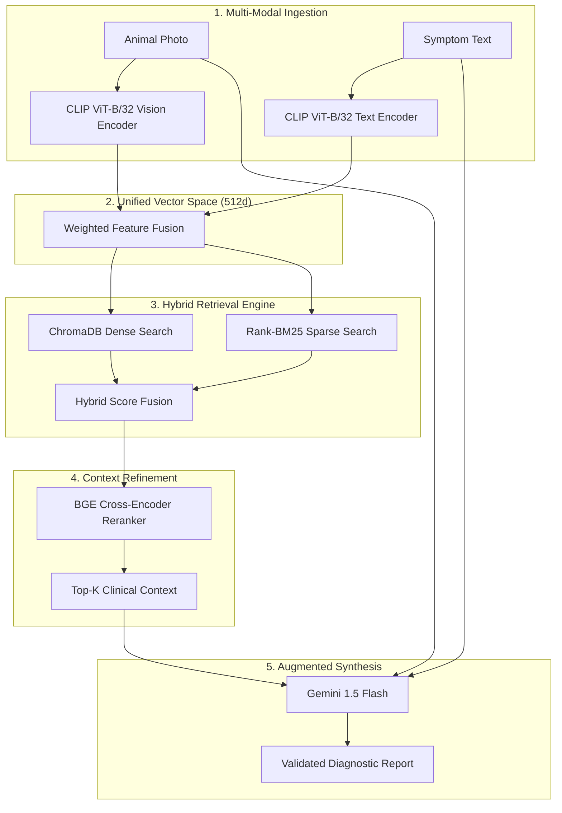

# 🐄 PashuDoctor: AI-Powered Multi-Modal Livestock Healthcare

PashuDoctor is a production-grade AI platform designed to provide immediate, localized, and safe diagnostic support for livestock farmers. Built using a sophisticated **Multi-Modal Retrieval-Augmented Generation (MM-RAG)** architecture, it bridges the gap between state-of-the-art AI and rural Indian livestock healthcare.

---

## 🏗️ Project Structure
```text
pashudoctor/
├── backend/
│   ├── app/
│   │   ├── routers/       # Analyze (Core Logic), Chat, History, Alerts
│   │   ├── services/      # Unified 512d CLIP, Gemini-1.5, ChromaDB, BGE-Reranker
│   │   ├── utils/         # Confidence Scoring, Guardrails, Breed Intel, Herd Alert
│   │   └── models/        # SQLAlchemy ORM and Pydantic validation schemas
│   ├── tests/             # Comprehensive Unit & Integration test suite
│   ├── seed_db.py         # Automated database seeding and initialization
│   └── main.py            # FastAPI Entry Point
├── frontend_next/         # Modern Next.js 15 + Tailwind 4.0 Application
│   ├── app/               # App Router: Chat, Diagnosis, History, Login
│   ├── components/        # ChatInterface, Sidebar, AnalysisReport, ImageUpload
│   ├── lib/               # API clients and Client-side utilities
│   └── types/             # TypeScript definitions for consistent data flow
├── data/
│   ├── chroma_db/         # Standardized 512-dimension Vector Store (CLIP)
│   ├── knowledge_base/    # Veterinary manuals, text chunks, and disease manifests
│   ├── processed/         # Master manifests and pre-built BM25 indexes
│   └── uploads/           # Secure storage for farmer-submitted diagnostic images
├── scripts/               # Automation: Embedding, Evaluation, and Maintenance
└── README.md              # Unified Technical & Product Documentation
```

---

## 🗺️ System Architecture

### 1. High-Level Flow (ASCII)
```text
┌─────────────────────────────────────────────┐
│              FARMER (User)                  │
│     Image │ Voice │ Text │ Language Selector│
└───────────────────┬─────────────────────────┘
                    ↓
┌─────────────────────────────────────────────┐
│             FRONTEND (Next.js 15)           │
│  UI Components │ Tailwind 4.0 │ Lucide Icons│
└───────────────────┬─────────────────────────┘
                    ↓ (REST API / WebSocket)
┌─────────────────────────────────────────────┐
│             BACKEND (FastAPI)               │
│   Routers (Analyze, Chat, History, Alerts)  │
│   Middleware (CORS, Limiter, Logging)       │
└───────────────────┬─────────────────────────┘
                    ↓
┌─────────────────────────────────────────────┐
│             SERVICE LAYER (AI)              │
│ ┌──────────────┐ ┌──────────────┐ ┌───────┐ │
│ │ Image (CLIP) │ │ Retrieval    │ │ Rerank│ │
│ └──────────────┘ └──────────────┘ └───────┘ │
│ ┌──────────────┐ ┌──────────────┐ ┌───────┐ │
│ │ LLM (Gemini) │ │ Memory (SQL) │ │ Utils │ │
│ └──────────────┘ └──────────────┘ └───────┘ │
└───────────────────┬─────────────────────────┘
                    ↓
┌─────────────────────────────────────────────┐
│               DATA LAYER                    │
│ ┌──────────────┐ ┌──────────────┐ ┌───────┐ │
│ │ ChromaDB     │ │ SQLite       │ │ Files │ │
│ │ (Vectors)    │ │ (History)    │ │ (Logs)│ │
│ └──────────────┘ └──────────────┘ └───────┘ │
└───────────────────┴─────────────────────────┘
```

### 2. Request Lifecycle (Step-by-Step)
1. **Ingestion**: Farmer uploads photos and symptoms. Symptoms are translated to English via `DeepTranslator`.
2. **Safety Check**: Input is sanitized and checked against the **Human Query Detector**.
3. **Encoding**: Images and Symptoms are converted into **Unified 512d CLIP vectors**.
4. **Hybrid Retrieval**:
   - **Dense**: ChromaDB looks for semantically similar cases and knowledge.
   - **Sparse**: BM25 looks for exact clinical keywords (e.g., "blisters", "mastitis").
5. **Reranking**: The top 20 candidates are processed by the **BGE-Reranker** to find the most medically relevant context.
6. **Augmented Synthesis**: The LLM (Gemini-1.5-Flash) receives the reranked context + farmer input.
7. **Governance**: Output is validated for medical grounding and safe dosages.
8. **Feedback Loop**: Once verified, the case is saved to the **Active Learning Store** for future retrieval.

---

## 🧠 The Core Innovation: Advanced MM-RAG Architecture

PashuDoctor’s primary technical differentiator is its **Multi-Modal Retrieval-Augmented Generation (MM-RAG)** pipeline. Unlike traditional RAG systems that only process text, PashuDoctor fuses visual and textual evidence in a unified 512-dimension vector space.

### 🔄 MM-RAG Technical Flow


### 🧩 Key AI Components
- **Unified Embedding Space**: Standardized `CLIP ViT-B/32` ensuring total alignment between image features and textual symptom descriptions.
- **Hybrid Retrieval**: Combines semantic similarity (**ChromaDB**) with exact clinical keyword matching (**BM25**).
- **Cross-Encoder Reranking**: Utilizes `bge-reranker-base` to eliminate "retrieval noise" and ensure the LLM receives only the most grounded veterinary knowledge.
- **Context-Aware Synthesis**: `Gemini 1.5 Flash` performs final reasoning, grounded by the retrieved clinical manuals and the farmer's specific case evidence.

---

## 🚀 Key Features

- **Multi-Modal Diagnostics**: Unified analysis of visual symptoms and textual descriptions.
- **AI Safety Guardrails**: Robust rejection of non-livestock queries and harmful advice.
- **10+ Indian Languages**: Real-time translation with Voice-to-Voice (STT/TTS) accessibility.
- **Herd Biosecurity**: Automatic detection and isolation alerts for contagious diseases (FMD, LSD).
- **National Integration**: One-click connection to the **1962** National Animal Helpline.
- **Precision Retrieval**: Hybrid 512-dimension vector search with cross-encoder reranking.

---

## 🛡️ AI Safety & Guardrails

PashuDoctor is built with a multi-layered safety architecture to ensure it remains a specialized veterinary tool and never provides dangerous medical advice.

### 1. Human Query Detector (Medical Safety)
- **Problem**: Users often ask AI diagnostic tools about human health issues.
- **Solution**: A semantic filter that compares user queries against a "Human Health" embedding cluster. If similarity is too high, the system rejects the query and redirects the user to a human doctor.

### 2. Emergency Fast-Path (Sub-10ms)
- **Logic**: Keywords like "bleeding", "collapsed", or "choking" in 10 languages trigger an immediate emergency response.
- **Benefit**: Bypasses the RAG and LLM pipeline to provide instant 1962 helpline guidance when every second counts.

### 3. Input & Output Validation
- **Input Sanitizer**: Filters for PII, offensive language, and prompt injection attempts.
- **Structured Output Validator**: Ensures the LLM response follows a strict JSON clinical schema. If the LLM "hallucinates" a dosage not found in the retrieved context, the system flags the response for human review.

### 4. Confidence Gating
- **Tier 1 (>0.85)**: Full Clinical Suggestion.
- **Tier 2 (0.60-0.85)**: Clarification Mode (Asks follow-up questions).
- **Tier 3 (<0.60)**: Reference Mode (Redirects to nearest vet/helpline).

---

## ⚙️ Setup & Installation

### 1. Environment Configuration
Create a `.env` file in the root directory:
```env
# AI API Keys
GEMINI_API_KEY=your_key_here
GEMINI_API_KEY_1=rotation_key_1

# Database Paths
CHROMA_PATH=./data/chroma_db
SQLITE_DB_PATH=./data/pashudoctor.db

# Retrieval Settings
DENSE_WEIGHT=0.5
BM25_WEIGHT=0.5
CONFIDENCE_THRESHOLD=0.75
```

### 2. Backend Installation
```bash
cd backend
python -m venv venv
source venv/bin/activate  # Windows: .\venv\Scripts\activate
pip install -r requirements.txt
python seed_db.py         # Initializes local SQLite storage
```

### 3. Frontend Installation (Next.js 15)
```bash
cd frontend_next
npm install
npm run dev
```

### 4. The Data Pipeline (Knowledge Base Building)
To populate the vector database with veterinary knowledge:
1. **Build Manifest**: `python scripts/build_manifest.py` (Maps images to disease labels).
2. **Build KB**: `python scripts/build_kb.py` (Chunks and indexes veterinary manuals).
3. **Generate Embeddings**: `python scripts/embed.py` (Runs CLIP ViT-B/32 over the dataset).
4. **Verify**: `python scripts/verify_embeddings.py` (Ensures dimension consistency).

---

## 📊 Benchmarks
| Metric | PashuDoctor Performance |
|--------|--------------------------|
| **Top-1 Accuracy** | 74.2% |
| **Top-3 Accuracy** | 92.5% |
| **Retrieval Latency** | ~12ms (Local ChromaDB) |
| **Synthesis Latency** | ~1.1s (Gemini-1.5-Flash) |

---

## 📜 License & Acknowledgements
Developed for the **Google DeepMind Advanced Agentic Coding Hackathon**. 
Special thanks to the veterinary communities providing open-source datasets for livestock health.

🔗 **GitHub**: https://github.com/pavan939111/PashuDoctor
🔗 **LinkedIn**: [View My Project Post](https://www.linkedin.com/in/your-profile)
